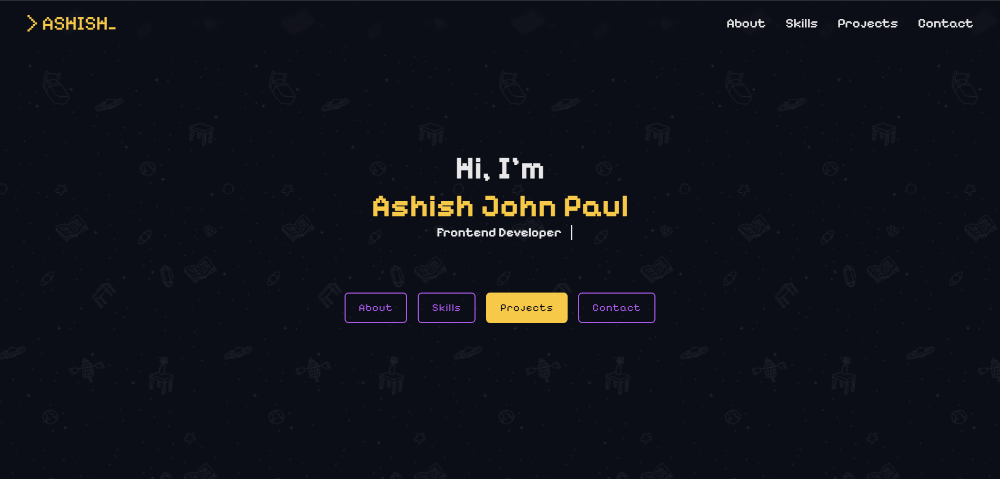

# Ashish's Portfolio👾

A retro themed personal portfolio built with React.
Features a scrolling background, pixel fonts, Retro styled
sections and a Pac-Man loader.

## Live Demo
[View Portfolio](https://ashish-portfolio.vercel.app)

## Screenshots

## Built With
- React
- React Router
- react-spinners
- CSS3
- Vite
- Pixelify Sans (Google Fonts)

## Sections
- Home — Hero with typewriter animation
- About — RPG character sheet style
- Skills — Interactive hover reveal skill cards
- Projects — Full detail project cards
- Contact — Contact form with social links

## Getting Started
1. Clone the repo
2. Run `npm install`
3. Run `npm run dev`